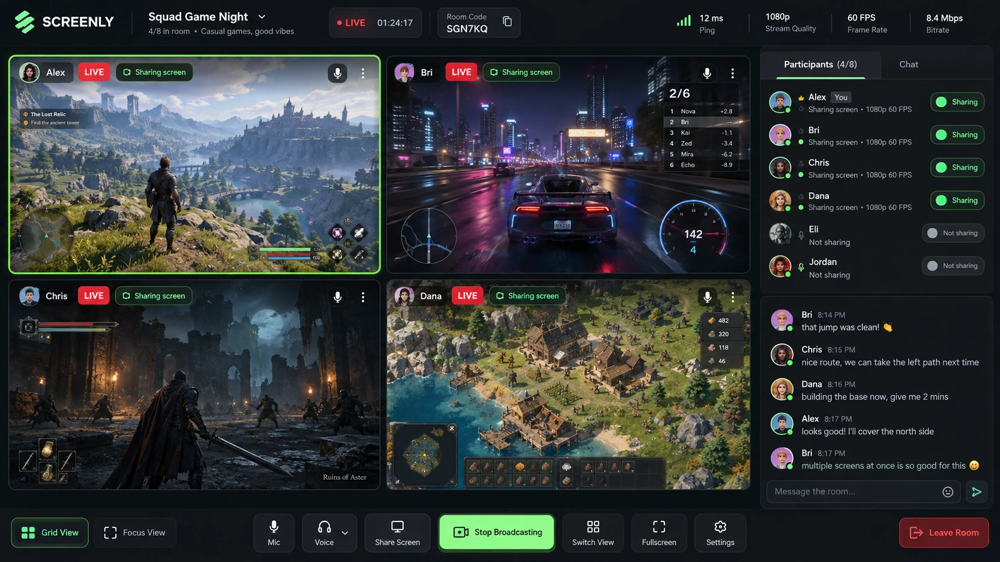

# UI — repaginação da interface

Pasta de referência do design do Kamus. Tudo o que define **como a interface deve parecer e se
comportar** fica aqui; o código continua em `web/`.

| Arquivo | Conteúdo |
| --- | --- |
| `README.md` | Especificação (este arquivo) e como ela foi aplicada |
| `TOKENS.md` | Cores, tipografia, espaçamentos e regras de uso |
| `referencias/prototipo.webp` | Protótipo visual de referência |

## Direção

**70% Industrial Minimalism + 20% Developer UI + 10% Gaming UI.** Limpo, técnico e profissional,
com o conteúdo transmitido como elemento dominante. Sem cyberpunk exagerado, neon em excesso,
glassmorphism ou efeitos decorativos.

## Especificação

### 1. Layout principal
- Interface desktop/web em **dark mode**.
- Área principal ocupada por **múltiplas transmissões simultâneas**.
- **Sidebar lateral fixa** para participantes e chat.
- **Barra superior** para informações da sala.
- **Barra inferior** para controles globais.

### 2. Estética visual
- Minimalismo com influência de Gamer UI.
- Fundo charcoal/preto, painéis em cinza escuro e divisórias discretas.
- Evitar cyberpunk exagerado, excesso de neon, glassmorphism e efeitos decorativos.

### 3. Sistema de cores
- Dark mode como tema principal.
- Branco/cinza para texto e informações secundárias.
- **Uma única cor de destaque**: verde-limão / verde elétrico.
- **Vermelho reservado** para LIVE, Parar e Sair da sala.

### 4. Grid de transmissões
- Todos podem transmitir ao mesmo tempo.
- Grid responsivo, adaptável ao número de transmissões (1×1, 2×1, 2×2, 3×2, 3×3…).
- Cada transmissão ocupa o máximo de espaço possível; o vídeo é o elemento visual dominante.

### 5. Card de transmissão
- Avatar, nome, indicador **LIVE**, status **Transmitindo**, estado do microfone e menu contextual.
- A transmissão selecionada tem **borda de destaque discreta**.

### 6. Modos de visualização
- **Grade**: todas as transmissões ao mesmo tempo.
- **Foco**: amplia a transmissão selecionada (as outras ficam em miniatura).
- Trocar de tela rapidamente, sem interromper nenhuma transmissão.

### 7. Sidebar de participantes
- Todos os membros conectados; fica claro quem está ou não transmitindo.
- Status: Transmitindo / Não transmitindo, microfone, conexão.
- Informação compacta da transmissão: `1080p · 60 FPS`.

### 8. Chat lateral
- Divide a sidebar com os participantes.
- Simples e vertical, como chats de jogos: avatar, nome, horário e mensagem.
- Campo de texto sempre visível embaixo.
- Não compete visualmente com as transmissões.

### 9. Controles da sala (barra inferior)
- Somente o essencial: Mic, Áudio, Compartilhar tela, Transmitir/Parar, Grade/Foco, Tela cheia,
  Configurações e Sair da sala.
- O botão de transmissão tem **forte feedback visual** quando ativo.

### 10. Informações técnicas e UX
- Métricas discretas: ping, resolução, FPS, bitrate e qualidade da conexão.
- Barra superior: nome da sala, quantidade de participantes, código da sala, status LIVE e duração
  da sessão.
- Prioridade: legibilidade, baixa distração e acesso rápido às funções durante jogos.

## Como foi aplicado (decisões)

| Item | Decisão |
| --- | --- |
| Idioma | Interface em **português**. Termos consagrados ficam como estão: LIVE, FPS, ping. |
| Mic e Áudio | **Só visual por enquanto**: botões e ícone de microfone aparecem desabilitados, com a dica "a voz fica no Discord". Reservam o lugar para uma voz futura. |
| Compartilhar tela × Transmitir | **Transmitir** inicia/para a transmissão. **Compartilhar tela** troca a janela/tela compartilhada **sem derrubar** a transmissão (`replaceTrack`). |
| Código da sala | É o próprio nome da sala (`/s/<sala>`); o botão ao lado copia o link. |
| Duração da sessão | Tempo desde a criação da sala no LiveKit (informado pelo servidor). |
| Métricas | Ping = RTT da sinalização. Resolução, FPS e bitrate = estatísticas WebRTC da transmissão **selecionada** (enviada, se for a sua; recebida, se for de outra pessoa). |
| `1080p · 60 FPS` na sidebar | Altura real da transmissão + FPS do preset escolhido por quem transmite (atributo `fps`). |
| Conexão | `connectionQuality` do LiveKit, mostrada como ponto no avatar (ver `TOKENS.md`). |
| Menu Amigos | Continua na barra superior, ao lado do nome da sala. |
| Celular | A barra inferior some com Transmitir/Compartilhar; o app explica que celular só assiste. |
